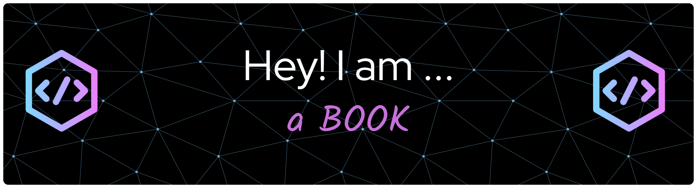

<!--
## Hi there 👋

**Mar2rech/Mar2rech** is a ✨ _special_ ✨ repository because its `README.md` (this file) appears on your GitHub profile.

Here are some ideas to get you started:

- 🔭 I’m currently working on ...
- 🌱 I’m currently learning ...
- 👯 I’m looking to collaborate on ...
- 🤔 I’m looking for help with ...
- 💬 Ask me about ...
- 📫 How to reach me: ...
- 😄 Pronouns: ...
- ⚡ Fun fact: ...
-->

<!--
**Used Material**
https://leviarista.github.io/github-profile-header-generator/  (Banner Profile)
https://readme.so/ (.md Files)
https://codepen.io/ (Templates)(Editor)
https://github.com/inttter/md-badges (BADGES)(V)
https://shields.io/ (badges)
-->
